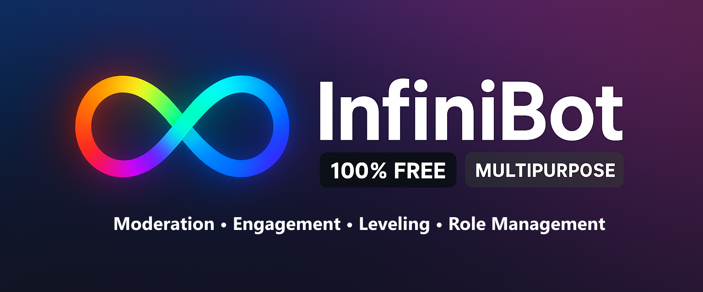

<div align="center">

# InfiniBot

**A powerful, multi-purpose Discord utility bot built for millions of servers**



[](https://github.com/cypress-exe/InfiniBot/stargazers)
[](https://github.com/cypress-exe/InfiniBot/network)
[](https://github.com/cypress-exe/InfiniBot/issues)
[](https://github.com/cypress-exe/InfiniBot/blob/main/LICENSE)
[](https://discord.gg/mWgJJ8ZqwR)


[🚀 Quick Start](#-quick-start) • [📖 Documentation](#-documentation) • [🔧 Installation](#-installation) • [🤝 Support](#-support)

[](https://discord.com/oauth2/authorize?client_id=991832387015159911&permissions=1374809222364&scope=bot)

</div>

## ✨ Features

InfiniBot is a multipurpose Discord utility bot designed to scale across thousands of servers using SQLite for storage, docker for containerization, and sharding for distribution. InfiniBot offers a variety of features including:

### 🛡️ Moderation & Security
- **Advanced Profanity Filter** - Customizable word filtering with strike system
- **Intelligent Spam Detection** - Multi-layered anti-spam protection
- **Comprehensive Logging** - Track all messages and moderator actions, including message edit and deletion history
- **Automated Moderation** - Smart auto-moderation with configurable thresholds and punishments

### 🎉 Community Features
- **Leveling System** - Reward active members with XP and role rewards
- **Birthday Celebrations** - Never miss a community member's special day
- **Reaction Roles** - Self-assignable roles via emoji reactions
- **Custom Role Messages** - Automated role assignment messages
- **Welcome/Leave Messages** - Personalized greetings for new members

### 🎪 Entertainment
- **Joke Commands** - Built-in entertainment features
- **Motivational Messages** - Boost server morale
- **And more!**

> **Note:** External contributions are welcome! You're free to fork, contribute, and self-host for personal use or small friend groups. However, please do not create competing public instances that would conflict with the official InfiniBot service.

## 📋 Prerequisites

InfiniBot runs inside a Docker container, so Docker must already be installed. You can find documentation for setting up Docker [here](https://docs.docker.com/get-docker/).

Additionally, you need to have a Discord bot registered with Discord. You can register your bot at the [Discord Developer Portal](https://discord.com/developers/applications).

Follow these steps to set up InfiniBot for a Linux environment. Some steps may vary for certain operating systems.

## 🚀 Quick Start

Get InfiniBot up and running in just a few minutes:

### 1️⃣ Clone the Repository
```bash
git clone https://github.com/cypress-exe/InfiniBot.git
cd InfiniBot
```

### 2️⃣ Build the Container
```bash
sudo bash build.bash
```
Docker will begin building the container, which may take some time on the first run.
> 💡 **Tip:** Use `--use-cache` flag for faster builds (after initial setup)

### 3️⃣ Initial Run
```bash
sudo bash run.bash
```
> ⚠️ **Expected:** You'll see an error about missing environment variables - this is normal!

### 4️⃣ Configure Environment
```bash
sudo vim .env
```
Set your Discord bot token:
```env
DISCORD_AUTH_TOKEN=your_bot_token_here
```
> ⚠️ **Important:** Only modify the `DISCORD_AUTH_TOKEN` variable. Leave others unchanged.

### 5️⃣ Start InfiniBot
```bash
sudo bash rebuild_and_run.bash
```

🎉 **Success!** InfiniBot should now be running. Don't forget to invite your bot to a server!

## ⚙️ Configuration

You can customize InfiniBot's behavior through the `./generated/configure` folder:

- **🤬 Profanity Filter** - Add/remove words from `default_profane_words.txt`
- **👨‍💻 Developer Settings** - Configure admin IDs and bot settings in `config.json`

> 📝 **Note:** Most settings are pre-configured for the official InfiniBot and should be left unchanged for self-hosted instances.

## 🛠️ Development Scripts

The following scripts are available to manage the project:

### 🔨 `sudo bash build.bash`
Builds the project Docker image without running it.

**Arguments:**
- `--use-cache` - Uses cache for faster rebuilds

### 🗑️ `sudo bash remove_container.bash`
Removes the project's container while preserving the build image.

### ▶️ `sudo bash run.bash`
Runs the project (assumes image exists and previous container is removed).

**Arguments:**
- `-d` - Detached mode (no logs shown)

### 🔄 `sudo bash rebuild_and_run.bash`
Streamlined workflow: stops container → rebuilds → restarts.

**Arguments:**
- `--no-cache` - Rebuilds without cache (slower but may resolve issues)

### 🔧 `sudo bash run_tests.bash`
Runs the project's test suite to ensure everything is functioning correctly.

## 📖 Documentation

User documentation is available on the [InfiniBot Docs Website](https://cypress-exe.github.io/InfiniBot/) and provides detailed information on:
- **Installation** - Step-by-step setup guide
- **Configuration** - How to customize settings
- **Commands** - List of available commands and their usage
- **Features** - Overview of all bot features and functionalities


Developer documentation is available in the `./docs` folder of this repository.

## 🤝 Support

- **🐛 Bug Reports** - [Create an issue](https://github.com/cypress-exe/InfiniBot/issues)
- **💡 Feature Requests** - [Submit a request](https://github.com/cypress-exe/InfiniBot/issues)
- **💬 Discord Support** - [Join the server](https://discord.gg/mWgJJ8ZqwR)

## 📊 Project Stats

<div align="center">


</div>

## 🏗️ Built With

- **🐍 Python** - Core bot logic
- **🔗 nextcord** - Discord API wrapper
- **🗃️ SQLite** - Database storage
- **🐳 Docker** - Containerization
- **⚡ Asyncio** - Asynchronous programming

## 📜 License & Usage

This project is licensed under a **Custom Open Source License** based on GPL v3 - see the [LICENSE](LICENSE) file for details.

**Usage Guidelines:**
- ✅ **Personal Use** - Fork, modify, and self-host for personal use or small friend groups
- ✅ **Contributions** - Pull requests and contributions are welcome!
- ✅ **Open Source Derivatives** - Any modifications must also be open source
- ✅ **Learning** - Use the code for educational purposes
- ❌ **Public Competition** - Hosting competing public instances is prohibited
- ❌ **Commercial Use** - Commercial use without explicit permission is prohibited

**Contributing:**
1. Fork the repository
2. Create a feature branch (`git checkout -b feature/amazing-feature`)
3. Commit your changes (`git commit -m 'Add some amazing feature'`)
4. Push to the branch (`git push origin feature/amazing-feature`)
5. Open a Pull Request

---

<div align="center">

**Made by [cypress.exe](https://github.com/cypress-exe)**

⭐ Star this repository if you found it helpful!

</div>
